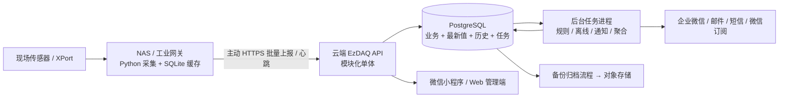

# EzDAQ 商用架构、能力缺口与实施计划

编制日期：2026-10-05。评估依据：当前仓库代码、已有使用说明，以及本次 NAS → 微信云开发 → 手机的现场验证。

目标：按可商用推广设计，先以单站 1–10 台设备试点验收，再支持多个客户。本文是实施建议和计划，没有把拟建功能算作已经完成，也不代表已经改变现有运行系统。

## 1. 当前结论

已有一条可用的真实采集链路：韩感 LH8950 / XPort → Python → 群晖 NAS 容器 → 微信云开发 → 手机小程序。Windows 工具可以查找和配置 XPort，显示通讯状态和收发 HEX；小程序可以看设备、查询告警并认领、闭环。

目前仍是单现场 MVP。真实湿度返回 FFFF，已按无效显示；负温分支未完成实测确认。云端保存的是最新值，趋势不是实际历史；Web 中心是无鉴权、模拟数据和 JSON 文件持久化的演示服务。已有技术方案中的 Java、Go、MQTT、时序库等不能计入当前实现。

**建议商业默认采用云端 SaaS + 现场边缘网关，保留同一套软件的客户独立部署方式。后端用模块化单体，业务与历史数据先统一使用 PostgreSQL，NAS 使用 SQLite 保存待补传采样。**

SaaS 是交付与运营模式，不要求把应用拆成微服务。商用的关键是客户数据隔离、监控可靠性、可恢复的数据、告警送达与可持续运维。

## 2. 能力缺口统计

按下列 20 个能力项划分：**3 项可继续复用、9 项已有基础但需补强、8 项未实现**。这是本文的功能分类统计，不是商用完成百分比；多个客户隔离、可靠上报、历史和告警等关键项未达标时，不能用总数判断是否可以交付。

优先级：P0 为对外收费交付前的必要能力；P1 为推广和规模扩大时完善；P2 为后续增值功能。

| 编号 | 能力 | 当前状态 | 缺口与实际影响 | 优先级 / 交付项 |
| --- | --- | --- | --- | --- |
| C01 | 真实设备接入 | 需补强 | LH8950 温度已实测，湿度探头无效、负温未验证；其他协议只在方案或演示中 | P0：有效温湿度探头、协议测试与支持型号清单 |
| C02 | 手机实时查看 | 可复用 | 总览、搜索、区域筛选、扫码、详情已具备；需适配正式后端与权限 | 复用页面，联调正式登录、真实历史 |
| C03 | 人工告警处置 | 可复用 | 认领、说明、闭环及并发更新检查已具备；物理状态与人工处置分开 | 复用流程，补完整处置事件记录 |
| C04 | XPort 桌面维护 | 可复用 | 已支持查 IP/MAC/端口、改 IP、实时读数及 HEX | 保留为售后诊断工具，完善版本发布 |
| C05 | 可靠常驻采集 | 需补强 | NAS 容器和采集循环已运行；单配置、无持久补传队列与多设备调度 | P0：多设备独立轮询、缓存、退避重试与健康检查 |
| C06 | 真实历史与报表 | 未实现 | 微信只覆盖最新值，Web 趋势为模拟；事后无法追溯超限前后数据 | P0：历史入库、聚合趋势、CSV 导出 |
| C07 | 环境告警规则 | 需补强 | 阈值硬编码且偏水泵用途；无湿度上下限、持续时间、恢复阈值配置 | P0：设备/测点级规则、迟滞、持续时间、恢复事件 |
| C08 | 离线与数据质量 | 需补强 | 查询时能判离线、湿度能标无效；无独立超时扫描，品质覆盖不完整 | P0：网关心跳、传感器离线、无效/陈旧数据独立告警 |
| C09 | 主动通知 | 未实现 | 当前要打开小程序才能看告警；无发送任务、重试和失败升级 | P0：至少一个持续通知渠道及发送记录；微信订阅辅助 |
| C10 | 正式管理后台 | 未实现 | Web 为演示；设备注册、规则、成员与通知设置仍依赖控制台操作 | P0：Web 管理端和授权 API，减少人工改库 |
| C11 | 用户与角色权限 | 需补强 | 微信身份、viewer/operator/admin 已有；无邀请、禁用、站点授权管理 | P0：企业成员邀请、角色、站点范围、账号撤销 |
| C12 | 多客户隔离 | 未实现 | 列表/详情/告警只有微信登录检查，没有 tenant 条件 | P0：客户隔离、接口/导出/对象存储/后台任务一致授权 |
| C13 | 资产与测点模型 | 需补强 | 有设备档案和指标字典；没有正式站点、网关、测点、单位及校准模型 | P0：客户 → 站点 → 网关 → 设备 → 测点 |
| C14 | 网关交付管理 | 未实现 | 无注册绑定、配置版本、状态页、远程诊断包和升级回退机制 | P0：注册、配置验证、版本状态；P1：受控批量升级 |
| C15 | 上报与密钥安全 | 需补强 | 有 HTTPS、HMAC、时间窗口；签名不覆盖读数，未做 nonce 去重与密钥轮换 | P0：完整报文验签、网关身份绑定、幂等、轮换和撤销 |
| C16 | 审计与追溯 | 需补强 | 告警保留最近处理人/说明，未形成完整事件流水 | P0：规则变更、成员授权、导出、密钥与告警操作审计 |
| C17 | 备份与恢复 | 未实现 | 项目未配置、验证数据恢复流程；云厂商的备份能力不等于项目已验收 | P0：自动备份、恢复演练、保留与删除策略 |
| C18 | 部署和运行保障 | 需补强 | 有 Git、测试、Compose 和手册；无统一 CI、环境隔离、链路监测 | P0：开发/试点/生产隔离、构建发布、监控和回滚 |
| C19 | 套餐与用量 | 未实现 | 无客户设备/测点/存储配额、用量计量或服务到期管理 | P0：基础配额和人工开通；P1/P2：账单、在线支付 |
| C20 | 正式商用发布与售后 | 未实现 | 真机预览已验证；主体/备案/正式审核、合同、支持服务未核对 | P0：正式发布材料、验收与售后约定、第三方许可清单 |

### 2.1 代码核对中发现的关键问题

1. `shared-lib/index.js` 中温度预警/故障阈值是 75/90℃，没有湿度规则。这套水泵规则不能直接当作机房环境阈值；实际阈值应由客户和场景确认，不在代码中设一个全局数值。
2. `deviceReport` 中离线候选在收到上报后、超限逻辑内检查。没有独立定时扫描；设备完全停止上报时，不能依靠该入口主动生成离线事件和通知。
3. `deviceReport` 签名输入仅为 `deviceId:timestamp`，没有签名 metrics、quality 和 source。五分钟窗口限制过旧请求，但不等于窗口内防重放；需增加完整报文完整性与重复请求识别。
4. 上报先覆盖设备最新值，告警失败仅打印日志，仍返回已收到。商用需把采样落库与告警待处理任务原子提交，让规则处理失败可以重试、追踪。
5. `deviceList` 单次最多查询 100 条，汇总只基于返回数据。扩大规模后会漏设备/统计不全；需分页和授权范围内的独立统计。
6. `deviceList`、`deviceDetail`、`alarmList` 未限制客户和站点，不能把当前公共云环境直接开放给多个客户。
7. 当前 Python 驱动上报失败后进入下一轮，没有保存失败采样；容器重启与断网会丢失尚未成功上传的数据。
8. `seedInit` 用于初始化演示数据，没有业务访问控制；正式环境需从发布清单移除或严格限制调用。五台演示设备须迁出正式客户台账，不能混在收费客户界面中。

上述为仓库代码评估。当前云环境的实际访问规则、AppID 主体、套餐、备份配置和已部署代码版本尚未独立审计，列入第一阶段核查。

## 3. SaaS、独立部署与边缘架构

| 方式 | 适合的客户 | 优势 | 代价 | 建议 |
| --- | --- | --- | --- | --- |
| 多客户 SaaS | 常规机房、小型厂区、分散站点 | 客户只部署网关，平台统一升级和维护，可按年订阅 | 必须做好客户隔离、容量、配额、服务支持 | 默认商业形态 |
| 客户专属实例 | 数据隔离或独立部署有要求的企业 | 独立应用/数据库/存储，可放客户云或服务器 | 多实例升级、备份与售后成本更高 | 作为付费选项，复用同一代码 |
| 全部放现场 NAS | 自用、小站点封闭网络 | 本地查看和采集不依赖外网 | 远程访问、通知、备份与硬件维护由现场承担 | 可做独立部署试点；家庭 NAS 不承担商业 SaaS 中心 |

推荐初期 SaaS 的模型是：共享应用 + PostgreSQL 共享表中的 tenant_id 隔离。高隔离需求客户使用专属部署。暂不为每个普通客户动态创建一套数据库，也不在首版构建租户分库路由平台。

### 3.1 技术栈与组件安排

| 层 | 首版选择 | 实施边界 |
| --- | --- | --- |
| 小程序 | 继续原生微信小程序 | 复用四个现有页面，增加正式登录、授权、历史、品质提示；不用同时重写 uni-app |
| 管理 Web | Vue 3 + TypeScript | 企业、成员、设备、测点、规则、通知、历史和用量；当前演示 Web 保留为联调工具 |
| 中心后台 | TypeScript + NestJS 模块化单体 | 身份/客户、资产、接入、历史、告警、通知、审计分别作为模块；与当前 Node 团队和代码衔接 |
| 后台任务 | 同仓库的独立 worker 进程 | PostgreSQL 任务/outbox 表领取任务，事务和租约保证可重试；接入与通知可分别扩容 |
| 主数据库 | 受支持的 PostgreSQL 稳定版本 | 优先评估中国区域可用的托管服务；私有部署可用同版数据库镜像 |
| 边缘采集 | 保留 Python，增加多设备调度和 SQLite | 当前 LH8950 驱动做成插件；NAS、Linux 和 Windows 服务使用同一采集核心 |
| 文件 | 云对象存储；私有部署使用兼容对象存储 | 导出、备份、诊断包、升级包。使用租户隔离目录和授权下载 |
| 缓存 | 首版可不用独立 Redis | 最新值先存 PostgreSQL；确有缓存/限流瓶颈再引入，不能拿缓存代替持久历史 |
| MQTT | 接口预留，首版继续 HTTPS | 现有设备为轮询、规模小；需要长连接、多网关推送或远程命令时再接入 broker |
| 部署 | 应用容器 + worker + 数据库 + 对象存储 | 小规模用 Compose/受管容器；保持数据库不对公网开放 |

NestJS 提供基于模块组织 Node.js 应用的方式，可作为上述模块化后台基础；采用它是结合当前项目的工程选择，不是 SaaS 的强制要求。[NestJS 官方文档](https://docs.nestjs.com/)

原《EzDAQ EPS 技术方案》的 Spring Boot/Go/TimescaleDB/MQTT 是另一条完整演进路线。若固定开发团队主要是 Java，可把后台替换为 Spring Boot，领域模型与数据方案不变；首版选定一条路线后不要同时维护两套生产后台。Go 网关、Electron、专用时序库及微服务拆分放在有明确需求后的阶段。

### 3.2 客户与权限隔离

- 用户可以属于多个客户，通过企业邀请建立成员关系；微信登录身份不直接等同于某客户成员。
- 企业管理员、站点负责人、操作员、只读用户按角色及站点授权；平台运营管理员使用独立受控入口。
- 服务端从已验证会话和成员关系确定 tenant_id，网关凭据绑定所属企业/站点。客户端传入的 tenant_id、deviceId 都要再次校验。
- 设备、规则、历史、告警、任务、审计、导出文件等都带客户范围；跨客户引用使用组合约束或等效校验。
- PostgreSQL RLS 可作数据库第二道约束，应用连接使用无 BYPASSRLS 的非表拥有者角色；连接池在事务内设置租户上下文，完成后不得残留。迁移、平台运维、后台任务使用单独授权路径。
- 自动测试要覆盖换 deviceId/tenantId、分页、总数、导出、对象下载和通知收件人，不能只测试页面隐藏。

PostgreSQL 支持行级安全策略，但表拥有者和有绕过权限的角色存在例外，不能仅启用开关就认为隔离完成。[PostgreSQL RLS 文档](https://www.postgresql.org/docs/current/ddl-rowsecurity.html)

### 3.3 是否全部自研：先验证成熟物联网底座

“采用 SaaS”与“后台全部自己开发”是两项不同决策。为减少重复建设，第一周安排 2–3 个工作日验证 ThingsBoard 作为物联网底座的可行性，同时保留现有小程序和 Python 驱动。

| 路线 | 适用情况 | 可节省的工作 / 代价 | 本项目安排 |
| --- | --- | --- | --- |
| 自研模块化后台 | 需要自有成员、告警处置、微信集成和商业套餐，长期维护产品 | 自主掌握业务与数据契约；历史、规则、权限、通知和运维基础均需自行实现并验收 | 本文数据模型和 12 周排期按此路线估算 |
| ThingsBoard + EzDAQ 接入与小程序服务层 | 标准设备、历史、规则和管理功能能满足大部分需求 | 可复用平台已有能力；仍需韩感适配、微信登录、通知集成、权限映射、升级和许可证核对 | 第一周做小规模验证；满足验收条件后重新估算工期和成本 |

ThingsBoard 官方列出多租户、设备/资产、时序数据、仪表盘、规则及 REST API 等能力；具体采用哪个版本、哪些功能可用，需要按选定发行版验证。[ThingsBoard 官方介绍](https://thingsboard.io/docs/why-thingsboard/)

社区版使用固定角色，Customer user 对分配资源为只读；专业版提供可定制角色和细粒度权限。因此不能直接假设社区版已经满足 EzDAQ 操作员认领、闭环及站点授权要求，也不能把小程序请求统一转为全权管理员操作。[ThingsBoard 角色文档](https://thingsboard.io/docs/user-guide/roles/)

验证必须完成：LH8950 真实数据接入、断网补传、24h/7d 历史查询、两个客户的隔离、小程序用户按权限认领/闭环、至少一个实际通知渠道，并列出版本许可、部署成本和二次开发边界。若选平台底座，使用其正式 API 管理数据，避免直接修改平台内部表或同时维护两套历史/告警引擎；S1 之前冻结最终路线。本文的自研表结构作为业务契约参考，不强制套用到平台内部数据库。

## 4. 数据库与存储形式

### 4.1 为什么首版选择 PostgreSQL

客户、成员、站点、规则、告警与合同用量有关系和事务需求；历史采样可以用同一数据库的时间分区表，首版减少多库一致性和维护成本。

| 选项 | 在本项目的定位 | 决策 |
| --- | --- | --- |
| 当前 CloudBase 文档库 | 已运行 MVP；可继续承载现有试点，需扩展集合、索引和授权 | 作为过渡链路，不能让它和新库长期各自形成一套事实来源 |
| PostgreSQL | 业务关系、事务、最新值、历史分区、审计 | 首版主存储 |
| PostgreSQL + TimescaleDB | 较大历史量的时序优化与聚合工具 | 扩展候选；先做兼容性、运维和许可核对及实测 |
| 独立时序数据库 | 明确大量高频采集且需要专门时序能力时评估 | 当前阶段不另建一套历史数据系统 |
| SQLite | 单个边缘网关的本地队列、配置版本和有限诊断 | 仅用于网关缓存，不承载多客户中心 |
| JSON 文件 / CSV | 传输消息、配置导入导出、用户报表 | 不作为生产平台的主数据库 |

PostgreSQL 原生支持时间范围分区及分区维护。[PostgreSQL 分区文档](https://www.postgresql.org/docs/current/ddl-partitioning.html) PostgreSQL 许可允许在保留声明等条件下使用和分发。[PostgreSQL 许可](https://www.postgresql.org/about/licence/)

TimescaleDB 不是不能用于商用；不同部分采用 Apache 2.0 或 TSL，产品内使用与对外提供数据库服务的条件不同。引入时记录具体版本、所用功能及独立部署分发条件；本方案不依赖尚未核对的高级功能。[Timescale 官方许可](https://www.tigerdata.com/legal/licenses)

### 4.2 将五类数据分别保存

| 数据 | 形式 | 示例 / 用途 |
| --- | --- | --- |
| 业务配置 | PostgreSQL 普通关系表 | tenants、memberships、sites、gateways、devices、points、rules、notification_routes |
| 当前值 | point_latest / gateway_status 表 | 首页快速查最新值、最后有效时间、通讯与品质；不扫描历史 |
| 历史采样 | 按 collected_at 时间分区的 point_samples 表 | 一条测点一次采样一行，保留数值、品质、采样时间、接收时间、sample_id |
| 告警与任务 | alarms、alarm_events、notification_jobs、outbox、audit_events | 告警状态、物理恢复、处置过程、发送尝试与配置变更分别追溯 |
| 文件与冷归档 | 对象存储中的 CSV / 压缩 Parquet / 诊断包 / 备份 | CSV 给用户；Parquet 供长期归档与后续分析，首版可先只做 CSV 和备份 |

关系字段、关键索引和可查询测点值用明确列。协议参数、厂商附加字段可用 JSONB，避免把全部时序数据塞在一个不断增长的 JSON 对象里。

### 4.3 最小数据契约

采样应含：tenant_id（由服务端身份确定）、site_id、gateway_id、device_id、point_id、sample_id、collected_at、received_at、value、quality、config_version。测点定义保存名称、单位、量程、数据类型、换算、协议地址和采样周期。

- 数值环境点可先用 DOUBLE PRECISION；客户要求精确十进制的计量点另设类型。累计量与开关量定义独立语义，不强行全部当作温度数值。
- 无效湿度示例：value=NULL，quality=invalid，raw_value=65535。不能把 FFFF 变成 6553.5%RH，也不能把无效值写成 0。
- quality 至少区分 good、invalid、stale、comm_error；保存有效与无效样本，曲线显示缺口，聚合排除无效样本并返回有效覆盖率。
- collected_at 表示现场采样时刻，received_at 表示云接收时刻；数据库使用 UTC 时间，前端按站点时区显示。迟到补传不能把旧值更新成首页最新值。
- 示例索引：(tenant_id, point_id, collected_at DESC)。分区内幂等约束必须包含分区键；例如 UNIQUE(tenant_id, point_id, collected_at, sample_id)，sample_id 在重试中保持不变。
- 设备业务编号可在客户内唯一，内部 ID 使用稳定唯一值；不能依赖 IP/MAC 作为业务主键。更换探头后历史身份、校准版本和维护记录可追踪。

### 4.4 保留、聚合与查询策略

以下为首版建议默认值，须和客户套餐/合同及实测成本一致，不是现有系统已具备的承诺。

| 数据 | 建议默认保留 | 做法 |
| --- | --- | --- |
| 原始采样 | 90 天 | 首期按月分区，预建未来分区；按保留策略整体清理旧分区 |
| 5 分钟聚合 | 1 年 | min/max/avg/count、first/last、有效覆盖率、超限时长；保留峰值，不能只有均值 |
| 小时聚合 | 3 年 | 月报、年报及长期变化；允许按套餐调整 |
| 告警、处置与审计 | 首版 1 年 | 按业务约定配置、支持导出与客户终止后的数据交接 |
| 现场队列 | 默认 72 小时，且设容量上限 | 以先触发的限制为准，队列满要产生明确故障，不能静默丢弃 |
| 原始 HEX / 诊断日志 | 默认 7 天，异常样本优先 | 滚动文件或有限诊断表；按需启用完整抓取，禁止无上限全量保存 |

24 小时趋势查询细粒度，7/30 天查询聚合值；接口限制每条曲线返回点数，例如最多 2,000 点。长时间范围自动选择分辨率，CSV 大导出作为异步任务生成授权下载链接。

### 4.5 当前规模的容量估算

估算口径：每台设备温度、湿度共两个点，每 35 秒一组；一条测点一行。不把“一台设备”误当作“一条数据”。无效品质样本也计入保存量。

每日测点行数 = 设备数 × 每设备测点数 × 86,400 ÷ 采样秒数。

| 设备数 | 每日历史行数，约 | 90 天历史行数，约 | 按每行含常用索引 200–400 字节的粗估 |
| --- | --- | --- | --- |
| 1 | 4,937 | 44 万 | 0.09–0.18 GB |
| 10 | 49,371 | 444 万 | 0.9–1.8 GB |
| 100 | 493,714 | 4,443 万 | 8.9–17.8 GB |
| 1,000 | 4,937,143 | 4.44 亿 | 88.9–177.7 GB |

这是逻辑存储粗估，不含副本、WAL、备份、聚合表、任务、原始报文、空间预留和云计费；实际行宽与索引需导入真实样本测量。采样间隔改为 1 秒，数据量约为 35 秒方案的 35 倍。

达到百万级日写入、长范围趋势变慢或压缩/聚合维护成本明显增长时，启动 TimescaleDB 或独立时序引擎的对比压测；这是评估触发条件，不是 PostgreSQL 的能力上限。扩展通过历史存储模块实现，并包含迁移、回填和回退验证。

## 5. 可靠采集、告警与数据一致性

### 5.1 现场缓存与可靠上报

1. 每个设备独立调度和超时，不让一台超时设备堵住全部轮询；同一个 XPort 保证单一采集者。
2. 采样生成 sample_id 后先保存本地 SQLite，再尝试上报；容器重启后继续发送未确认队列。
3. 使用 HTTPS 批量上报。签名覆盖协议版本、网关 ID、发送时刻、nonce 和请求体摘要；服务端绑定网关身份、限制请求大小和频率。
4. 服务端事务提交历史、符合采样时间顺序的最新值、以及待处理事件后才返回持久确认。重复批次返回幂等确认；本地收到确认后删除对应队列记录。
5. 失败用退避重试和随机抖动；重试保留 sample_id 和 collected_at，但使用当前发送时刻签名。历史补传不能受现有 30 秒“覆盖最新值”节流规则丢弃。
6. 单独发送网关心跳，包含版本、队列深度、采集错误计数和最后上报结果，区分网关故障、传感器故障和云链路故障。
7. SQLite 放在 NAS 本地卷的独立可写挂载；程序和密钥继续受限只读。校验磁盘满、队列容量、重启一致性和运行时版本。WAL 数据库不放 SMB/NFS 网络挂载上。

SQLite WAL 要求使用数据库的进程在同一主机，不能依赖网络文件系统共享 WAL；本方案使用 NAS 本地卷。[SQLite WAL 文档](https://www.sqlite.org/wal.html)

### 5.2 商用告警应覆盖哪些情况

- 温湿度上下限、持续时间、恢复阈值和维护期静默；规则按客户/站点/测点配置。
- 独立定时任务判设备数据陈旧、网关心跳中断、品质持续无效；不要求有人打开小程序才触发。
- 物理异常状态与 pending/ack/done 人工处置状态分开；恢复产生恢复事件，人工闭环不等于测量恢复。
- 用单个活动告警和唯一事件键处理重复，跨进程任务领取有并发保护；升级、恢复和重开都有完整事件流水。
- 规则版本变更保存操作者、原因和前后值；边缘端应用配置时回报版本。
- 历史补传默认只补历史，不在恢复网络时给客户补发几十条过时紧急通知；如需追溯告警，标注为历史事件。

通知建议以企业微信应用/获准机器人或邮件作为首期持续通道，按客户实际可用渠道选一个完成验收；关键等级可配置短信备用。微信小程序订阅消息作为补充，不能假设商业类账号拥有无限长期推送权限，模板资格和授权次数要在真实账号核查。[腾讯云微信小程序订阅消息说明](https://cloud.tencent.com/document/product/1301/103770)

发送任务保存渠道、收件人范围、尝试次数、下次重试时间、供应商返回码；接口接受消息不等于人员已经阅读。需要人工确认、超时升级和备用联系人，通知供应商故障也要进入运行监测。

## 6. 商用时容易遗漏的问题

| 问题 | 具体安排 |
| --- | --- |
| 传感器“在线”但数值无效 | 页面分别显示通讯、数值品质、超限和处置状态；当前湿度无效不能在销售时描述为温湿度都已正常验收 |
| 测量准确度与校准 | 建设备量程、精度、校准时间与更换记录；有效湿度和负温需用设备资料及实际读数验证 |
| 35 秒“实时”是否满足客户 | 温湿度首期可按 35 秒验证；漏水、烟感等事件采用更快采集或事件输入，现场声光提示单独设计；不把分钟级周期套用全部类型 |
| 家庭 NAS 的设备用途 | 当前 NAS 是采集节点和验证环境；推广时按客户现场条件交付 NAS/工业网关，商业中心使用独立可维护云环境 |
| 断网与停电 | 缓存只补偿已采到的数据；网关断电期间未采到的值不能恢复。明确缺口显示、现场供电与 UPS 选项 |
| 密钥发放和撤销 | 一次性注册绑定、独立凭据、轮换与失窃撤销；不把配置 secret 放在手机、公共仓库或通用安装包中 |
| 网关 IP 修改和远程升级 | 配置校验后试运行、失败回退；远程改变网络或串口可能中断现场连接，应要求有权限的维护操作和审计 |
| 同一传感器被多人读取 | 网关维护采集租约/进程锁；LabVIEW、桌面工具诊断与正式采集需要协调，不持续争抢 XPort 连接 |
| 大客户拖慢其他客户 | 按客户限制网关、测点数、上报频率、历史、导出并发和通知用量；后台补传限速，实时任务优先 |
| 最新值与历史补传混淆 | 明确采样时刻、接收时刻和迟到状态；历史回填不反向覆盖当前值、不把网关重放当作传感器恢复 |
| 现场时钟漂移 | 网关校时并上报时钟状态，服务端识别未来时间和异常偏移；采样时间与接收时间都保留，防止趋势错位或签名失效 |
| 断云期间仍需现场告警 | 若客户要求关键环境异常在断网时也提醒，增加边缘规则与本地声光/其他可用通道；云端告警无法代替失去外网后的现场提示，需单独验收 |
| 云端服务挂了谁提醒 | 接入独立于业务服务的健康检测和运维通知；数据库容量、队列堆积、告警 worker 和备份失败均有监测 |
| 数据归属与合同终止 | 合同写清归属、导出格式、保留期限、删除与备份到期处理；客户数据迁出和跨客户禁用纳入验收 |
| 备份“有文件”但无法恢复 | 定期在隔离环境恢复，核对最近样本、用户/规则、权限、对象文件和密钥；记录实际耗时与恢复点 |
| 套餐价格只按设备计算 | 同时计测点、频率、存储、短信和售后工时；短周期、长历史、专属部署分别计成本 |
| 正式发布主体与备案 | 第一周核查小程序主体、类目、备案、隐私说明和合法域名；预览码不等于正式商用发布。国内上线应核查适用备案流程。[工信部备案说明](https://wap.miit.gov.cn/jgsj/xgj/hlwgl/art/2023/art_564bf0759d7e41d5b4aa8ce4996b9e84.html) |
| 商业许可与开源 | 当前仓库为 MIT；商业模块授权、分发声明和第三方依赖许可单独确定，保留必要版权声明；厂商私有协议/SDK 资料亦核对使用范围 |
| 演示与客户真实数据混在一起 | 开发、演示、客户生产用不同环境；销售演示明确标注，正式界面不默认演示或允许普通用户切换云环境 |

## 7. 实施计划与交付安排

计划基准：2026-10-05 启动，约 12 个日历周；**2 名开发人员（后台/网关与前端各一名）+ 兼职测试/现场支持，产品负责人由用户承担**。实际按成员投入、节假日、设备/账号准备和平台审核调整。日期为工程排期示例，不是已预约执行时间；单人实施按约 16–20 周重新估算。

| 阶段 | 参考日期 / 周次 | 具体交付 | 负责人 | 阶段验收 |
| --- | --- | --- | --- | --- |
| S0 基线和范围 | 10-05～10-11，第 1 周 | 有效探头与协议清单；核对 AppID/云规则/备份；冻结首期点位与通知渠道；验证 ThingsBoard 对照路线；确定数据模型/API、部署模式、采样与保留策略 | 产品 + 后台/网关 + 现场 | 明确每台设备、每个点、单位、周期；温湿度正常读数可核对；商用账号条件和风险有记录；冻结自研/平台路线并复核排期 |
| S1 商业后端底座 | 10-12～10-25，第 2–3 周 | PostgreSQL、客户/站点/成员/网关/测点表；登录邀请/RBAC/租户隔离；v2 完整签名上报、幂等落库、任务 outbox；CI 与试点环境 | 后台主责，前端接登录 | 两个测试客户交叉访问全部被拒；重复/篡改报文用例通过；当前试点链路有回退方案 |
| S2 数据可靠性与历史 | 10-26～11-08，第 4–5 周 | 多设备调度、SQLite 队列、心跳与健康页；真实历史、最新值、5 分钟聚合、24h/7d 趋势及 CSV | 网关/后台 + 前端 | 1–10 台采集；断网 1h/重启后补传，无逻辑重复，迟到值不覆盖最新；真实趋势可对照 |
| S3 主动告警与管理 | 11-09～11-22，第 6–7 周 | 可配置上下限/持续时间/恢复；定时离线与品质检测；持续通知通道、重试升级；Web 设备、规则、成员、通知管理；完整处置与配置审计 | 后台 + 前端 | 不打开小程序也能触发并发送离线/超限告警；阈值抖动、恢复、通知失败、越权处置测试通过 |
| S4 运维与商用交付 | 11-23～12-06，第 8–9 周 | 备份/PITR 恢复演练；发布、迁移与回滚；日志与独立监测；配额/用量/服务期限；正式发布材料、安装升级和售后手册 | 后台/运维 + 产品 + 测试 | 从备份恢复；网关/NAS 重启恢复；配额不影响其他客户；审核材料提交并可跟踪 |
| S5 现场试点 | 12-07～12-20，第 10–11 周 | 单站 1–10 台连续 14 天测试；故障演练；修复问题；验证第二测试客户隔离与成本；校准性能指标 | 全体 + 客户现场 | 采集/历史/告警/通知完整记录；恢复指标、数据缺口和故障均可解释；严重问题清零 |
| S6 受控商用发布 | 12-21～12-27，第 12 周 | v1.0 发布包、变更记录、验收清单、报价套餐、支持服务和回退材料；小范围客户开通 | 产品 + 开发/测试 | 所有 P0 通过；正式平台审核与备案条件完成才对外发布，外部等待时间单独计 |

单站试点是商业版的验证规模，不意味着删除客户隔离和基本安全。即使第一台现场网关只有一个站点，也在测试环境建两个客户验收隔离。

### 7.1 任务依赖与实施顺序

**S0 数据与身份契约 → S1 安全接入/数据库 → S2 缓存与历史 → S3 告警与管理 → S4 交付运维 → S5 实测 → S6 发布。**

成员管理页面、Web 设备管理、主体材料和售后材料可在 API 契约确定后并行准备。历史、告警和备份共享统一数据模型，避免在旧云库和新数据库分别写两套长期维护的功能。新增真实协议必须有设备和资料支持，不将全部协议接入列成同一周的承诺。

### 7.2 商用验收目标

以下为第一版设计目标，需 S5 实测后再写入客户服务承诺。

| 检查项 | 目标和验证方法 |
| --- | --- |
| 实时采集 | 35 秒点位在正常网络下，95% 样本从采样完成到云持久确认不超过 10 秒；详情区分采样时间和接收时间 |
| 历史完整性 | 持续 14 天记录应采/实采/有效/已确认数，正常供电通讯时有效采样率目标 ≥99.5%；计划维护与故障另计，不能隐藏缺失 |
| 断网补传 | 断云 1 小时但现场设备正常，采样保存在网关；恢复后补齐、幂等、不覆盖新值，补传耗时记录 |
| 重启恢复 | NAS/容器重启后，在网关恢复运行的两个采样周期内重新采集；已持久化但未确认队列仍可重传 |
| 离线通知 | 35 秒周期建议超时 120 秒，扫描周期 30 秒，发送任务处理目标 30 秒：连续缺报后目标 180 秒内提交通知；供应商是否送达另记 |
| 阈值通知 | 达到配置持续时间后一个扫描/处理周期内生成告警并提交发送；上下限、恢复阈值、无效样本和抖动都有用例 |
| 趋势查询 | 首期目标为 100 台 × 2 点、35 秒周期、90 天数据及 20 个并发读用户的合成压测；24h/7d 曲线最多 2,000 点，p95 ≤2 秒。数值为待验证目标 |
| 客户隔离 | 两客户互换设备 ID、历史参数、文件地址和任务 ID，所有越权读取/修改/统计/导出拒绝 |
| 备份恢复 | 目标 RPO ≤15 分钟、RTO ≤4 小时，以备份/WAL 和隔离环境恢复演练证明；只做每日备份不能声称满足该 RPO |
| 商业运营 | 可邀请/禁用成员、配置规则/收件人、开通/暂停客户、查看用量、导出交接数据，普通用户不需要改云数据库 |

PostgreSQL 的连续归档与 PITR 可以用于实现恢复点目标，但需要完整备份、WAL 归档及恢复步骤配套，不是建好数据库就自动具备。[PostgreSQL 备份与 PITR 文档](https://www.postgresql.org/docs/current/continuous-archiving.html)

### 7.3 首版之后的扩展

- P1：标准 Modbus TCP 插件、两种以上现场硬件验证、批量设备导入、批量受控升级、值班表与告警升级、自动月报、客户专属实例自动交付。
- P1：基于实际规模评估 MQTT、Redis、TimescaleDB、只读副本及接入进程单独扩容；满足指标后再做架构拆分。
- P2：在线订阅支付、经销商后台、白标品牌、SSO、复杂工单、Electron 大屏和额外移动端。
- 行业插件：漏水/烟感/门磁等事件型环境点先于大范围“支持所有协议”；UPS、配电、VISA/DLL 等按真实客户需求另排设备联调。

## 8. 当前云链路如何平稳迁移

1. 现有 `.178` 设备、微信界面和 NAS 继续运行，先在开发/试点环境搭建新商业后端。
2. 定义 v2 数据契约、正式 HTTPS API 和微信身份映射。原生小程序已有平台 API 服务层，但其当前令牌输入不是正式登录体系，需补服务端校验和成员绑定。
3. 迁移已有真实设备、规则、授权和有价值告警；演示数据单独归档。旧云没有保存的采样历史无法回填，清楚标注新历史起始时间。
4. 在同一网关采集一次，用同一 sample_id 将过渡测试样本发往验证环境；不能另启第二个采集进程争抢 XPort。避免双目标同时向客户发通知。
5. 对照采样值、品质、时刻、数量及告警后，按租户/站点受控切换小程序读源和网关目标。只保留一个正式事实来源，保留旧配置用于限时回退。
6. 回退演练验证旧系统能恢复实时查看；新系统已经保存的历史要保留/导出，不能因回退丢掉。切换期谁发通知、谁管理配置要有明确记录。

## 9. 用户需准备的材料与费用口径

先准备：首期 1–10 台设备清单和协议资料、可正常读湿度的探头、站点与成员名单、告警联系人及一个可用持续通知渠道、小程序主体/备案状态、可选域名、云部署地域、预算上限、需要保留的数据时长及客户验收范围。

不需要把所有账号密码发给开发者；通过合适的子账号/受限授权和独立网关凭据部署。计划阶段不额外购买硬件或云套餐。

费用至少拆为：云应用/worker、数据库与副本/备份、对象存储、流量、日志、短信/通知、现场网关与传感器、安装校准、后续运维。按实测日采样量和服务目标报价，不根据家庭试点“当前免费”推断商业长期零成本。本次没有取得供应商报价，不给虚构的月费数字。

推荐商业计费单位为站点基础服务 + 测点数量/采样频率/历史期限 + 可选通知和专属部署。首版可人工签约开通，先完成配额、到期提醒和数据交接规则，再接在线支付。

## 10. 证据与文档关系

| 证据 | 支持的判断 |
| --- | --- |
| [微信小程序说明](../apps/wechat-miniprogram/README.md)与页面源码 | 当前原生小程序功能、真实历史缺失、中心平台联调边界 |
| [共享规则源码](../apps/wechat-miniprogram/shared-lib/index.js) | 固定阈值、90 秒查询离线、基本角色定义 |
| [设备上报](../apps/wechat-miniprogram/cloudfunctions/deviceReport/index.js) | 当前 HMAC 输入、覆盖最新值、节流、告警判定与失败处理 |
| [设备列表](../apps/wechat-miniprogram/cloudfunctions/deviceList/index.js)、[告警列表](../apps/wechat-miniprogram/cloudfunctions/alarmList/index.js) | 当前范围查询没有客户隔离、列表限制 |
| [采集驱动](../apps/wechat-miniprogram/scripts/lhg8950_gateway.py) | LH8950 协议校验、湿度质量、单配置轮询与上报边界 |
| [中心服务](../apps/center-platform/server.mjs) | 模拟趋势、无生产身份鉴权、JSON 文件状态 |
| [群晖部署验证](../deploy/synology-lhg8950/README.md) | NAS 常驻采集和手机新上报验证；当前日志及重启验证边界 |

本文给出本次商用建议，原《EzDAQ EPS 技术方案》保留为之前的架构候选；具体实施前用数据契约、API 和迁移计划固化选定路线。本文不替代现场验收或供应商实际套餐条件。
